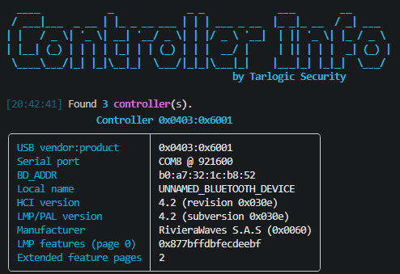
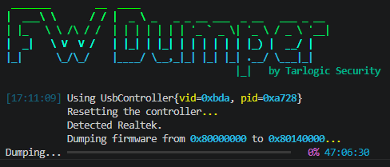
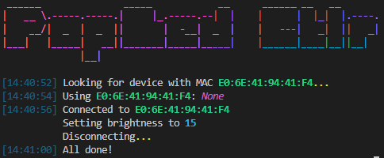

# Bluetooth Examples and Demos

A collection of Bluetooth tools, examples and demos useful for tools development based on UsbBluetooth.

## BleSpammer

A collection of Bluetooth spamming proof of concepts in a single C# application. Does not require any special hardware!

## Controller Info

Extract Bluetooth controller information using the standard HCI commands and hidden vendor commands.

## Firmware Dumper

A script that detects a Bluetooth controller and tries to extract it's firmware to a dump file.

## PopLed Controller

A script to take control of LED panels and screens.

## Vendor Command Enumerator

A single Python script that enumerates all possible hidden HCI vendor commands of a device.

